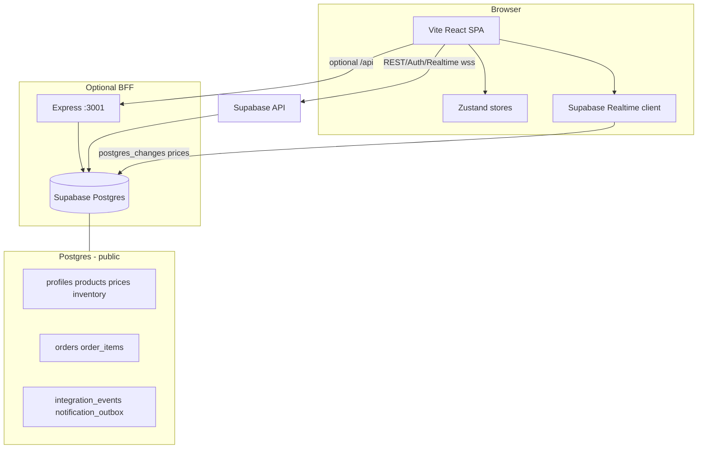

# Полный отчёт: оптовый маркетплейс (аудит, запуск, архитектура)

**Версия документа:** 1.0  
**Стек:** Vite + React + Zustand + Supabase (Postgres, Auth, Realtime, RPC) + Express BFF + i18next  
**Сопутствующие документы:** `docs/MANUAL-QA-CHECKLIST.md`, `docs/I18N.md`, `docs/ADMIN-INVESTOR-REPORT.md`, `README.md`

---

## 1. Резюме (итог проверки)

| Область | Статус | Комментарий |
|---------|--------|-------------|
| Сборка фронта | OK | `npm run build` |
| Unit-тесты | OK | `npm test` (Vitest) |
| Локальный запуск (npm) | OK | `npm run dev` / `dev:full` при настроенном `.env` |
| Docker `web` | OK при передаче `VITE_*` на этапе build | См. §2 |
| Docker `bff` | Исправлено в репозитории | В образ добавлен каталог `shared/` (раньше BFF в Docker не находил модули) |
| Supabase | Требует облачного проекта или `supabase start` | Миграции в `supabase/migrations/` |
| Админка (UI) | Функциональна при роли `admin` + миграции `admin_platform` | Рассылки — очередь в БД; фактическая отправка — вне репо |
| Realtime цен | OK | Таблица `prices` в публикации; клиент подписан |
| RPC `submit_order` | OK по коду | `FOR UPDATE` по `inventory`, цена из `prices` на момент заказа, `price_at_time` в `order_items` |

**Вывод:** проект готов к демонстрации при корректном `.env`, применённых миграциях и ручной регрессии по `docs/MANUAL-QA-CHECKLIST.md`. PDF из этого файла: §11.

---

## 2. Инструкция по запуску

### 2.1 Через npm (рекомендуется для разработки)

1. `npm install`
2. Скопировать `.env.example` → `.env` / `.env.local` (корень проекта):
   - `VITE_SUPABASE_URL`, `VITE_SUPABASE_ANON_KEY`
   - опционально `VITE_DEV_LOGIN_EMAIL`, `VITE_DEV_LOGIN_PASSWORD`
3. В Supabase выполнить SQL из `supabase/migrations/` **по порядку** (или `supabase db push`).
4. Назначить роли: `update public.profiles set role = 'admin' where id = '…';`
5. Запуск:
   - только фронт: `npm run dev`
   - фронт + BFF: `npm run dev:full` и в `.env` фронта `VITE_USE_BFF=true` (прокси `/api` — см. `vite.config`)

Проверка BFF: `curl -s http://localhost:3001/health`

### 2.2 Через Docker Compose

```bash
export VITE_SUPABASE_URL=https://xxx.supabase.co
export VITE_SUPABASE_ANON_KEY=eyJ...
# опционально для BFF:
export SUPABASE_SERVICE_ROLE_KEY=...
docker compose build
docker compose up -d web        # UI → http://localhost:8080
docker compose up -d bff        # API → http://localhost:3001
```

**Замечания:**

- Переменные `VITE_*` для сервиса `web` должны быть заданы **на этапе `docker compose build`** (build args в `docker-compose.yml`).
- Образ `web` — статика в nginx; для режима BFF с фронта нужны `VITE_USE_BFF=true` при сборке и доступность BFF с браузера (CORS/тот же хост или прокси). В текущем `nginx.conf` **нет** прокси на BFF — для продакшена часто объединяют за одним ingress или добавляют `location /api/`.
- Локальный Postgres в compose (`profile: db`, порт **5433**) **не заменяет** Supabase Auth/Realtime без доп. настройки.

### 2.3 Пошаговое тестирование

Используйте **`docs/MANUAL-QA-CHECKLIST.md`** (языки, суммы, skeleton, toast, FOMO, админка, RPC, гонки, Realtime).

---

## 3. Архитектура



**Потоки данных:**

- **Каталог / корзина:** клиент читает `products` + `prices` + `inventory` (или BFF агрегирует цены).
- **Заказ:** `validate_cart_stock` → `submit_order` (JWT → RLS); списание `inventory`, строки `order_items` с **`price_at_time`**.
- **Цены в реальном времени:** изменения в `prices` → Realtime → Zustand `productStore` → UI + toast (батч).
- **Админка:** RPC `admin_*`, RLS только для `admin`; рассылки пишутся в `notification_outbox`.

---

## 4. Таблицы Supabase (основные поля)

| Таблица | Назначение | Ключевые поля |
|---------|------------|---------------|
| `profiles` | Пользователь ↔ роль | `id`, `role` (`customer` / `supplier` / `admin`) |
| `products` | Товар | `supplier_id`, `name`, `category`, `wholesale_tiers`, `image_url` |
| `prices` | Цена (1:1 товар) | `base_price`, `discount_price`, `updated_at` |
| `inventory` | Остаток | `product_id`, `quantity` |
| `orders` | Заказ | `user_id`, `total_amount`, `status` |
| `order_items` | Позиции | `order_id`, `product_id`, `quantity`, **`price_at_time`** |
| `integration_events` | Лог интеграций | `type`, `payload`, `processed_at` |
| `notification_outbox` | Очередь рассылок | `channel`, `title`, `body`, `status`, `audience` |

---

## 5. RPC и функции

| Имя | Назначение |
|-----|------------|
| `validate_cart_stock(p_items jsonb)` | Проверка остатков без блокировки; коды `empty_cart`, `insufficient_stock`, `auth_required` |
| `submit_order(p_items jsonb)` | Транзакция: блокировка `inventory FOR UPDATE`, расчёт `resolve_unit_price`, вставка заказа и строк, списание остатков |
| `admin_sales_overview()` | JSON со статистикой (только admin) |
| `admin_enqueue_notification(...)` | Запись в `notification_outbox` + событие |
| `admin_bulk_apply_discount_percent(category, percent)` | Массовое обновление `discount_price` от `base_price` |

---

## 6. Триггеры и события (`integration_events`)

| Триггер / источник | Тип события |
|--------------------|-------------|
| `tr_prices_integration_event` | `price_updated` |
| `tr_orders_integration_event` | `order_created` |
| `tr_inventory_low_stock_event` | `low_stock` (переход остатка с ≥20 на &lt;20) |
| `admin_enqueue_notification` | `admin_notification_enqueued` |

Ограничение `integration_events.type` задаётся в миграции `20250322120005_admin_platform.sql`.

---

## 7. RLS (смысл политик)

- **Каталог:** чтение `products`, `prices`, `inventory` у всех аутентифицированных/анон (как в миграции `init`).
- **Запись цен/остатков:** владелец товара (`supplier_id = auth.uid()`), либо **admin**, либо товар платформы (`supplier_id is null`) — только **admin**.
- **Заказы:** пользователь видит свои; **admin** — все.
- **`notification_outbox`:** только **admin**.

Детали — в `20250322120000_init.sql` и последующих миграциях.

---

## 8. Проверенные сценарии и edge-кейсы

| Сценарий | Ожидаемое поведение | Где смотреть в коде |
|----------|---------------------|---------------------|
| Пустая корзина | Checkout показывает пустое состояние | `Checkout.tsx` |
| Товар удалён из каталога, но есть в корзине | Предупреждение, блок checkout, удаление «битых» строк | `Cart.tsx`, `Checkout.tsx` |
| qty &gt; stock | Подсказки в корзине; `validate_cart_stock` / ошибка `submit_order` | `orders` API, RPC |
| Цена изменилась после добавления в корзину | Realtime + подсветка строки; итог пересчитывается от актуальных данных / BFF quote | `productStore`, `Cart.tsx` |
| Медленная сеть | Skeleton, retry ошибки загрузки каталога | `Cart`, `Catalog`, … |
| Обрыв Realtime | Баннер + сброс в idle и reload каталога | `RealtimeStatusBanner`, `realtimeStore` |
| Ошибка RPC | Локализованные сообщения | `orderErrors.ts`, `mapRpcUserMessage` |

**Гонки:** в `submit_order` первая фаза берёт `inventory` с **`FOR UPDATE`** по отсортированным `product_id` — снижает риск deadlock и двойного списания; полная верификация — два параллельных клиента (см. чеклист).

---

## 9. Баги и исправления

### 9.1 Исправлено в ходе аудита документации/образов

| ID | Описание | Исправление |
|----|-----------|-------------|
| B-001 | **Dockerfile.bff** не копировал `shared/`, при этом `server/domain/catalogMap.ts` импортирует `shared/pricing` и `shared/product` — контейнер BFF падал бы при старте | Добавлено `COPY shared ./shared` в `Dockerfile.bff` |

### 9.2 Известные ограничения (не баги, а долг)

| ID | Описание | Рекомендация |
|----|-----------|--------------|
| L-001 | Рассылки из админки только ставят задачу в `notification_outbox` | Воркер + провайдеры (email/push/Telegram) |
| L-002 | Docker `web` без прокси на BFF | Добавить `location /api` в nginx или единый ingress |
| L-003 | Локальный `postgres` в compose без полного стека Supabase | Для Realtime/Auth использовать Supabase Cloud или `supabase start` |
| L-004 | Полный reconnect Realtime без перезагрузки страницы | Повторная подписка на канал по кнопке (улучшение UX) |

### 9.3 Потенциальные риски (мониторинг)

- Очередь `integration_events` без воркера может расти — нужны `processed_at` и джоба.
- Массовая акция `admin_bulk_apply_discount_percent` необратима без истории цен — рассмотреть таблицу кампаний / снимки.

---

## 10. Рекомендации (UX, FOMO, i18n, интеграции)

### 10.1 UX / FOMO / Skeleton

- Сохранить единый паттерн: skeleton → данные → ошибка + **Retry** (уже на части экранов).
- FOMO: не перегружать toasts; батч по ценам уже снижает шум.
- Низкий остаток: события `low_stock` можно показывать в админ-дашборде (следующий этап).

### 10.2 i18n

- Все новые строки — сразу в **kk / ru / en** (`docs/I18N.md`).
- Числа: `formatNumberAmount`; даты: `getDateFnsLocale` (kk = ru до появления kk-локали date-fns).

### 10.3 Mobile / Telegram / Оплата / Логистика

- **Mobile:** Capacitor или RN; те же API; push через FCM.
- **Telegram Mini App:** WebApp + `initData` на BFF; роль supplier для быстрых правок остатков.
- **Оплата:** отдельный сервис + вебхуки + статусы `orders.status` / таблица `payments`.
- **Логистика:** `shipments`, трекинг, интеграция с курьерами — заготовки в `server/integrations/delivery.ts`.

---

## 11. Экспорт в PDF

```bash
# при установленном pandoc:
pandoc docs/FULL-PROJECT-AUDIT-REPORT.md -o docs/FULL-PROJECT-AUDIT-REPORT.pdf --pdf-engine=xelatex
```

Либо открыть Markdown в VS Code / Cursor и **Print → Save as PDF**.

---

## 12. Подпись

Документ объединяет: инструкцию запуска, схему архитектуры, описание БД/RPC/триггеров, edge-кейсы, список багов/ограничений и рекомендации. Для формальной приёмки дополнительно приложите заполненный **`docs/MANUAL-QA-CHECKLIST.md`** с датами и билдом.
